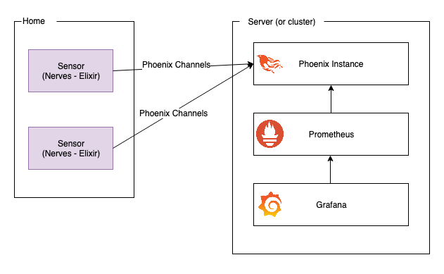

# iot-thermometer

## Goal of this project

I started this project to monitor my flat's temperature and humidity.
The extra goal was to work with Elixir and Nerves.

If you ask yourself, "Isn't it too much for the main goal ?". Yes it is. But I wanted to work with Elixir, because I love Elixir.

The sensors are using DHT22 sensors (available here on [Amazon](https://www.amazon.fr/dp/B01N9BA0O4/)) connected to RPIs through GPIO.

## Project status

This is a Work In Progress. But it actually work well on my local machine. Code needs to be refactored and cleaned.
Some values are hardcoded.

## Architecture



## How-tos

### Start the gateway (phoenix server)

```sh
mix deps.get
mix phx.server
```

### Burn the sensor SD card

```sh
export MIX_TARGET=rpi2
mix deps.get
mix firmware
mix firmware.burn
```

### Start grafana and prometheus

```sh
docker-compose up
```

## I want to use it

That's cool ! There are probably some bugs, feel free to fill and issue or send PRs.
